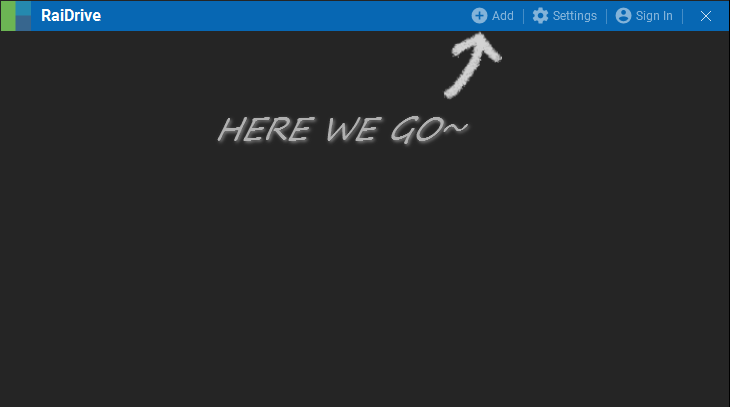
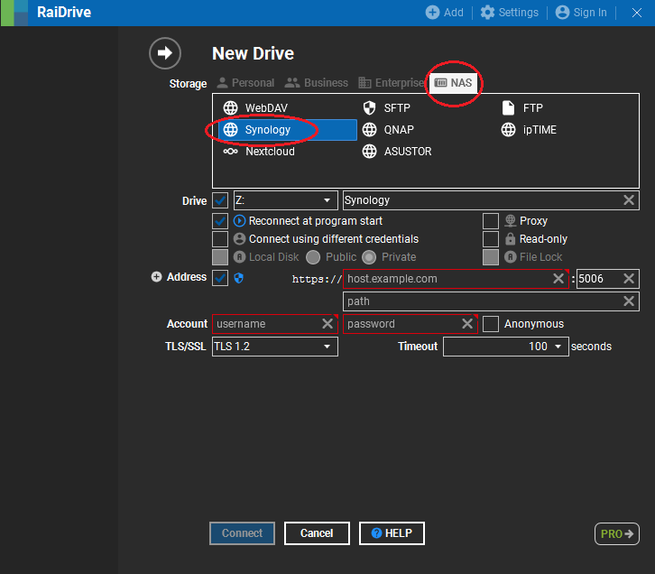
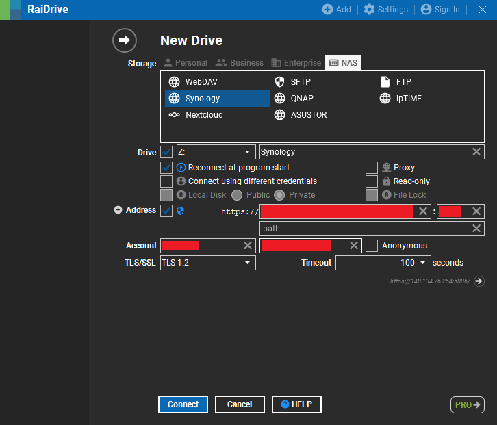
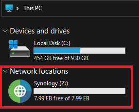

## Connect to Synology NAS with windows in few steps.
1. Intsall RaiDrive
  - https://www.raidrive.com/download

2. Click Add 

   

3. Choose NAS

   

4. Input `Address`:`ip`, `port`, `path`. Account info: `username`, `password`

   

5. Connect!

6. Check `local disk`

   
